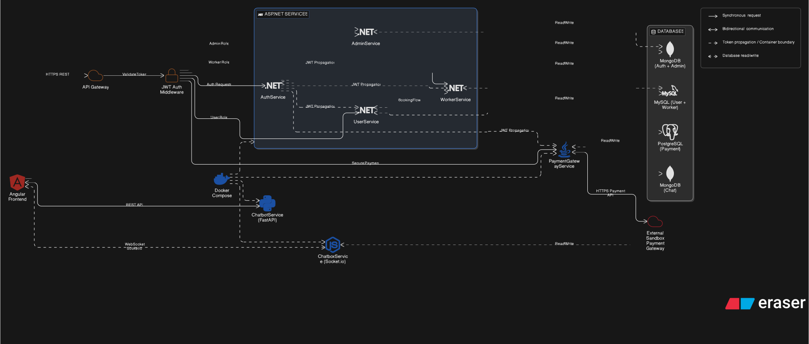

<div align="center">

# 🚗 AutoServeX

### Enterprise-Grade Vehicle Service Management Platform

[](https://angular.io/)
[](https://dotnet.microsoft.com/)
[](https://nodejs.org/)
[](https://spring.io/)
[](https://fastapi.tiangolo.com/)
[](https://docker.com/)
[](https://mongodb.com/)
[](https://mysql.com/)
[](https://postgresql.org/)
[](https://socket.io/)
[](https://jwt.io/)

<br/>

> A production-ready, cloud-deployable, **polyglot microservices** platform engineered to digitalize vehicle service booking at scale. Built by an 8-member cross-functional team, AutoServeX integrates **real-time communication**, **AI-powered assistance**, **secure payments**, and **role-based access control** across **7 independently deployable services** — all containerized with Docker.

<br/>

[Architecture](#-system-architecture) · [Services](#-microservices-breakdown) · [DevOps](#-devops--deployment) · [API Docs](#-api-reference) · [Setup](#-getting-started) · [Team](#-team--contributions)

</div>

---

## 📋 Table of Contents

- [Project Overview](#-project-overview)
- [Key Features](#-key-features)
- [System Architecture](#-system-architecture)
- [Microservices Breakdown](#-microservices-breakdown)
- [Technology Stack](#-technology-stack)
- [Service Integration Map](#-service-integration-map)
- [Real-Time Communication Layer](#-real-time-communication-layer)
- [Security Architecture](#-security-architecture)
- [DevOps & Deployment](#-devops--deployment)
- [Database Design](#-database-design)
- [API Reference](#-api-reference)
- [Getting Started](#-getting-started)
- [Testing](#-testing)
- [Project Structure](#-project-structure)
- [Team & Contributions](#-team--contributions)

---

## 🎯 Project Overview

**AutoServeX** is a full-stack enterprise application built on a **microservices architecture** that completely digitalizes the vehicle service booking and management lifecycle. The platform enables customers to discover services, book appointments, communicate with service technicians in real-time, and pay securely — all from a single, unified Angular frontend.

The system was designed to solve real-world operational problems faced by automotive service businesses:

- **Fragmented communication** between customers and service staff → Solved via Socket.io real-time chat
- **Manual booking management** → Solved via automated booking workflows with worker approval/rejection
- **Insecure monolithic payment systems** → Solved via isolated Spring Boot payment microservice with sandbox gateway
- **Lack of intelligent support** → Solved via Python FastAPI AI chatbot with 24/7 automated responses

### Why Microservices?

Each bounded domain (Auth, Users, Workers, Admin, Chat, Payments, AI) is isolated, independently deployable, and technology-optimized. A failure in the Chat Service does not cascade to the Payment Service. Each service scales horizontally based on its own load profile.

---

## ✨ Key Features

### 🔐 Authentication & Authorization
- Stateless JWT-based authentication with configurable token expiry
- Role-Based Access Control (RBAC) with three distinct roles: **Admin**, **Worker**, **User**
- Secure password hashing using bcrypt
- Middleware-level token validation across all protected microservice endpoints

### 👤 User Portal
- Self-service registration and login
- Browse and filter available vehicle services
- Book appointments with real-time worker availability checks
- Track booking status (Pending → Approved/Rejected → Confirmed)
- Make secure online payments via sandbox gateway
- Real-time chat with assigned service workers
- AI chatbot for instant query resolution and onboarding guidance

### 🔧 Worker Dashboard
- View all assigned service bookings with full customer context
- Manage and publish availability windows
- Approve or reject incoming booking requests with reason
- Send booking confirmations and service updates to users
- Direct real-time chat channel per customer booking

### 🛠 Admin Control Panel
- Full CRUD management: Users, Workers, Services, Bookings
- Platform-wide monitoring with booking and payment oversight
- Role assignment and privilege management
- Activity log and system health visibility

### 💬 Real-Time Communication
- Persistent WebSocket connections via Socket.io between users and workers
- Room-based chat architecture — one room per booking
- Message history stored in MongoDB for audit and continuity
- AI chatbot handles overflow queries and common FAQs

### 💳 Payment System
- Secure, isolated payment microservice built on Spring Boot
- Sandbox payment gateway integration for safe development and demo
- Full transaction lifecycle: initiation, validation, confirmation, logging
- PostgreSQL-backed ledger for ACID-compliant transaction records

### 🤖 AI Chatbot
- FastAPI-powered asynchronous AI service
- Handles common queries: pricing, availability, booking steps, vehicle types
- Seamlessly embedded in the Angular frontend as a chat widget
- Extensible for LLM integration (OpenAI / local models)

---

## 🏗 System Architecture

AutoServeX follows a **polyglot microservices pattern** where each service is developed in the technology best suited to its domain requirements:

```
╔══════════════════════════════════════════════════════════════════════════════════════════╗
║                            ☁️  CLOUD DEPLOYMENT BOUNDARY                                ║
║  ╔════════════════════════════════════════════════════════════════════════════════════╗  ║
║  ║                          🐳 DOCKER COMPOSE NETWORK                                ║  ║
║  ║                                                                                   ║  ║
║  ║   ┌─────────────┐   HTTPS/REST   ┌─────────────┐   JWT Route   ┌──────────────┐ ║  ║
║  ║   │   Angular   │ ─────────────▶ │ API Gateway │ ────────────▶ │  AuthService │ ║  ║
║  ║   │  Frontend   │                │   :8080     │               │  .NET + Mongo│ ║  ║
║  ║   │   :4200     │                └─────────────┘               └──────────────┘ ║  ║
║  ║   │  (Nginx)    │                       │                                        ║  ║
║  ║   └──────┬──────┘                       │  REST (Role-Based)                    ║  ║
║  ║          │                              ├──────────────────▶ ┌──────────────┐   ║  ║
║  ║          │                              │                    │ AdminService │   ║  ║
║  ║          │                              │                    │ .NET + Mongo │   ║  ║
║  ║          │                              │                    └──────────────┘   ║  ║
║  ║          │                              │                                        ║  ║
║  ║          │                              ├──────────────────▶ ┌──────────────┐   ║  ║
║  ║          │                              │                    │  UserService │   ║  ║
║  ║          │                              │                    │ .NET + MySQL │   ║  ║
║  ║          │                              │                    └──────────────┘   ║  ║
║  ║          │                              │                                        ║  ║
║  ║          │                              └──────────────────▶ ┌──────────────┐   ║  ║
║  ║          │                                                   │ WorkerService│   ║  ║
║  ║          │                                                   │ .NET + MySQL │   ║  ║
║  ║          │                                                   └──────────────┘   ║  ║
║  ║          │                                                                       ║  ║
║  ║          │  WebSocket ⚡ (Socket.io bi-directional)                              ║  ║
║  ║          ├────────────────────────────▶ ┌──────────────────┐                   ║  ║
║  ║          │                              │  ChatboxService  │                   ║  ║
║  ║          │                              │ Node.js + Socket │──▶ MongoDB (chat) ║  ║
║  ║          │                              └──────────────────┘                   ║  ║
║  ║          │                                       │ AI Fallback (REST)           ║  ║
║  ║          │  REST (AI Query)                      ▼                              ║  ║
║  ║          ├────────────────────────────▶ ┌──────────────────┐                   ║  ║
║  ║          │                              │  ChatbotService  │                   ║  ║
║  ║          │                              │ Python + FastAPI │                   ║  ║
║  ║          │                              └──────────────────┘                   ║  ║
║  ║          │                                                                       ║  ║
║  ║          │  REST HTTPS (Secure Payment)                                          ║  ║
║  ║          └────────────────────────────▶ ┌──────────────────┐                   ║  ║
║  ║                                         │ PaymentGateway   │──▶ PostgreSQL     ║  ║
║  ║                                         │ Spring Boot:5007 │──▶ 🌐 Sandbox GW  ║  ║
║  ║                                         └──────────────────┘                   ║  ║
║  ╚════════════════════════════════════════════════════════════════════════════════════╝  ║
╚══════════════════════════════════════════════════════════════════════════════════════════╝
```

### Architecture Diagram

> The diagram below was generated from the live system and reflects the actual inter-service communication paths, database bindings, and Docker network topology.



---

## 🔬 Microservices Breakdown

### 1. 🔑 AuthService — `ASP.NET Core` + `MongoDB`
**Port:** `5001` | **Database:** MongoDB (`authoservex_auth`)

Handles all identity operations. Issues signed JWT tokens upon successful login. All other services validate tokens against the AuthService's public key.

| Endpoint | Method | Description |
|---|---|---|
| `/api/auth/register` | POST | Register new user with role assignment |
| `/api/auth/login` | POST | Authenticate and receive JWT |
| `/api/auth/refresh` | POST | Refresh expired JWT |
| `/api/auth/validate` | GET | Validate token (used by other services) |

---

### 2. 🛡 AdminService — `ASP.NET Core` + `MongoDB`
**Port:** `5002` | **Database:** MongoDB (`autoservex_admin`)

Provides full platform visibility and management for administrators. Communicates with UserService and WorkerService via internal REST calls.

**Capabilities:** User/Worker CRUD, Service Catalogue management, Booking oversight, Role management, Platform activity monitoring.

---

### 3. 🚗 UserService (CoreService) — `ASP.NET Core` + `MySQL`
**Port:** `5003` | **Database:** MySQL (`autoservex_users`)

Core user-facing service. Manages the full booking lifecycle from discovery through confirmation.

**Capabilities:** Service browsing, Appointment booking, Availability viewing, Booking status tracking, Confirmation receipt.

---

### 4. 🔧 WorkerService — `ASP.NET Core` + `MySQL`
**Port:** `5004` | **Database:** MySQL (`autoservex_workers`)

Worker-facing service for managing job queues and availability schedules.

**Capabilities:** Availability management, Booking approval/rejection, Confirmation dispatch, Job history.

---

### 5. 💬 ChatboxService — `Node.js + Express` + `Socket.io` + `MongoDB`
**Port:** `5005` | **Database:** MongoDB (`autoservex_chat`)

> 🔑 **My Primary Contribution:** I architected and implemented this entire service, including the Socket.io real-time event system, room-based chat architecture, and MongoDB message persistence layer.

The real-time communication backbone of the platform. Uses persistent WebSocket connections with room-based isolation — each booking gets its own dedicated chat room, ensuring message isolation between customer sessions.

**Socket.io Events:**

| Event | Direction | Description |
|---|---|---|
| `join_room` | Client → Server | Join booking-specific chat room |
| `send_message` | Client → Server | Send message to room |
| `receive_message` | Server → Client | Broadcast message to room participants |
| `user_typing` | Client → Server | Typing indicator |
| `typing_indicator` | Server → Client | Broadcast typing status |
| `leave_room` | Client → Server | Gracefully exit room |

---

### 6. 🤖 ChatbotService — `Python (FastAPI)`
**Port:** `5006` | **No persistent DB** (stateless per session)

Asynchronous AI service that handles automated customer queries. Built on FastAPI for high-throughput async processing. Responds to natural language queries about services, pricing, and booking guidance.

---

### 7. 💳 PaymentGatewayService — `Spring Boot` + `PostgreSQL`
**Port:** `5007` | **Database:** PostgreSQL (`autoservex_payments`)

Isolated payment processing service. The Spring Boot runtime provides enterprise-grade transaction management with ACID compliance via PostgreSQL. Integrates with an external sandbox payment provider for safe testing.

**Transaction States:** `INITIATED` → `PROCESSING` → `CONFIRMED` / `FAILED` / `REFUNDED`

---

## 📡 Service Integration Map

This map shows **how services communicate** with one another — the most critical aspect of a distributed system:

```
┌─────────────────┐
│ Angular Frontend│
│    (port:4200)  │
└────────┬────────┘
         │
         ├─── [HTTPS REST] ──────────────────────────▶ ┌──────────────────┐
         │                                              │  API Gateway     │
         │                                              │    :8080         │
         │                                              └────────┬─────────┘
         │                                                       │
         │                                    ┌──────────────────┼──────────────────────┐
         │                                    │                  │                      │
         │                                    ▼                  ▼                      ▼
         │                           ┌──────────────┐  ┌──────────────┐  ┌─────────────────┐
         │                           │  AuthService │  │ AdminService │  │   UserService   │
         │                           │  JWT Issuer  │  │ .NET + Mongo │  │  .NET + MySQL   │
         │                           └──────────────┘  └──────────────┘  └─────────────────┘
         │                                                                         │
         │                                                              ┌──────────▼──────────┐
         │                                                              │   WorkerService      │
         │                                                              │   .NET + MySQL       │
         │                                                              └─────────────────────┘
         │
         ├─── [WebSocket ⚡ Socket.io — Bi-directional] ─────────────▶ ┌──────────────────┐
         │                  (Persistent Connection)                     │  ChatboxService  │
         │                                                              │ Node.js :5005    │
         │                                                              └────────┬─────────┘
         │                                                                       │
         │                                               [AI Fallback REST] ▼   │ [Write/Read]
         │                                                              ┌──────────────────┐
         │                                                              │  ChatbotService  │
         │                                                              │ Python FastAPI   │
         │                                                              └──────────────────┘
         │
         └─── [REST HTTPS — Secure] ─────────────────────────────────▶ ┌──────────────────┐
                                                                        │ PaymentGateway   │
                                                                        │ Spring Boot:5007 │
                                                                        └────────┬─────────┘
                                                                                 │
                                                                    ┌────────────▼──────────┐
                                                                    │  🌐 External Sandbox  │
                                                                    │   Payment Gateway     │
                                                                    └───────────────────────┘

─────────────────────────────────────────────────────────────────────────────────────────────
  AuthService      ──[JWT Propagation]──▶  All Protected Services (Admin, User, Worker, Pay)
  UserService      ──[Internal REST]───▶  WorkerService  (check availability)
  WorkerService    ──[Internal REST]───▶  UserService    (push confirmation)
  PaymentService   ──[Trigger REST]────▶  ChatboxService (create booking chat room)
  ChatboxService   ──[AI Fallback]─────▶  ChatbotService (offline worker auto-reply)
─────────────────────────────────────────────────────────────────────────────────────────────
```

### Cross-Service JWT Flow

```
  ┌─────────────────────┐
  │   User Login Request│
  └──────────┬──────────┘
             │
             ▼
  ┌─────────────────────────────────────────────────────────┐
  │  AuthService                                            │
  │  → Validates credentials against MongoDB               │
  │  → Issues RS256-signed JWT with role claim             │
  └──────────┬──────────────────────────────────────────────┘
             │
             ▼
  ┌─────────────────────┐
  │  JWT returned to    │
  │  Angular Frontend   │
  └──────────┬──────────┘
             │
             ▼
  ┌────────────────────────────────────────────┐
  │ Angular attaches JWT to every request:     │
  │  Authorization: Bearer <token>             │
  └──────────┬─────────────────────────────────┘
             │
             ▼
  ┌────────────────────────────────────────────┐
  │  API Gateway → JWT Middleware              │
  │  → Verifies signature                     │
  │  → Extracts role claim                    │
  └──────────┬─────────────────────────────────┘
             │
    ┌────────┴─────────────────────┐
    │                              │                    │
    ▼                              ▼                    ▼
┌───────────┐             ┌─────────────┐       ┌─────────────┐
│  ADMIN    │             │   USER      │       │   WORKER    │
│  role     │             │   role      │       │   role      │
│    ▼      │             │     ▼       │       │     ▼       │
│AdminSvc   │             │ UserSvc     │       │ WorkerSvc   │
│           │             │ PaymentSvc  │       │             │
└───────────┘             └─────────────┘       └─────────────┘
```

---

## 🔄 Real-Time Communication Layer

> **My Contribution:** Responsible for the Real-Time Communication Layer and Containerization Strategy across the entire platform.

The ChatboxService is the most technically complex component of the platform. Here's how it integrates with the rest of the system:

### Socket.io Architecture

```
  ┌──────────────────────────────┐          ┌────────────────────────────────┐
  │      Angular Frontend        │          │    ChatboxService (Node.js)     │
  │  ─────────────────────────  │          │  ────────────────────────────  │
  │  socket.connect()            │ ───────▶ │  io.on('connection')           │
  │  socket.emit('join_room')    │ ───────▶ │  socket.join(roomId)           │
  │  socket.emit('send_message') │ ───────▶ │  io.to(roomId).emit(msg)       │
  │  socket.on('receive_message')│ ◀─────── │  broadcast to room             │
  │  socket.emit('user_typing')  │ ───────▶ │  io.to(roomId).emit('typing')  │
  └──────────────────────────────┘          └────────────────┬───────────────┘
                                                             │
  ┌──────────────────────────────┐          ┌───────────────▼───────────────┐
  │      Worker Frontend         │          │     MongoDB (autoservex_chat)  │
  │  ─────────────────────────  │          │  ────────────────────────────  │
  │  socket.connect()            │ ───────▶ │  Write: messages collection    │
  │  socket.on('receive_message')│ ◀─────── │  Read:  conversation history   │
  │  socket.emit('send_message') │ ───────▶ │  Index: roomId + timestamp     │
  └──────────────────────────────┘          └───────────────────────────────┘
```

### Why Node.js for Chat?

Node.js's event-driven, non-blocking I/O model is architecturally superior for WebSocket management compared to thread-per-connection models. A single Node.js process can maintain thousands of concurrent Socket.io connections efficiently — critical for a platform expecting concurrent user-worker sessions.

### ChatboxService ↔ Spring Boot Integration

When a booking payment is confirmed by the **PaymentGatewayService (Spring Boot)**, it emits an internal REST event to the **ChatboxService**, which automatically creates a dedicated chat room for that booking and notifies both the user and assigned worker via Socket.io. This cross-service event chain ensures the chat room only activates for paid, confirmed bookings.

### ChatboxService ↔ FastAPI Integration

If a user sends a message and the assigned worker is offline, the **ChatboxService** forwards the message to the **ChatbotService (FastAPI)** via an internal REST call. The AI bot responds automatically, ensuring the user is never left without a reply. This fallback mechanism is transparent to the user.

---

## 🔒 Security Architecture

AutoServeX treats security as a cross-cutting concern, not an afterthought:

| Layer | Implementation |
|---|---|
| **Password Storage** | bcrypt hashing with per-user salt |
| **Authentication** | JWT (RS256 signed tokens, 24hr expiry) |
| **Authorization** | Role claims validated at API Gateway + service level |
| **Transport** | HTTPS/TLS enforced on all external endpoints |
| **Payment** | Isolated service, sandbox environment, no card data stored |
| **Database** | Separate DB instances per service domain (no shared schemas) |
| **Container** | Non-root Docker users, read-only mounts where possible |
| **CORS** | Strict origin whitelisting in all .NET and Node.js services |

---

## 🐳 DevOps & Deployment

> This section justifies the infrastructure complexity of an 8-person team managing 7 microservices across 4 technology stacks.

### Docker Compose Orchestration

All 7 backend services, 3 databases, and the Angular frontend are containerized and orchestrated via a single `docker-compose.yml`. This enables:

- **One-command startup** of the entire platform: `docker-compose up --build`
- **Isolated networking** — services communicate over a private Docker bridge network
- **Volume persistence** — database data survives container restarts
- **Environment isolation** — `.env` file drives all service configurations

### Docker Network Topology

```
  ╔══════════════════════════════════════════════════════════════════════════════╗
  ║           🐳  docker-compose network: autoservex_network (bridge)           ║
  ╠══════════════════════╦═══════════════════════════════════════╦══════════════╣
  ║  Container           ║  Base Image                           ║  Port(s)     ║
  ╠══════════════════════╬═══════════════════════════════════════╬══════════════╣
  ║  frontend            ║  nginx:alpine                         ║  4200 → 80   ║
  ║  api-gateway         ║  custom                               ║  8080        ║
  ║  auth-service        ║  mcr.microsoft.com/dotnet/aspnet:8.0  ║  5001        ║
  ║  admin-service       ║  mcr.microsoft.com/dotnet/aspnet:8.0  ║  5002        ║
  ║  user-service        ║  mcr.microsoft.com/dotnet/aspnet:8.0  ║  5003        ║
  ║  worker-service      ║  mcr.microsoft.com/dotnet/aspnet:8.0  ║  5004        ║
  ║  chatbox-service     ║  node:20-alpine                       ║  5005        ║
  ║  chatbot-service     ║  python:3.11-slim                     ║  5006        ║
  ║  payment-service     ║  eclipse-temurin:21                   ║  5007        ║
  ╠══════════════════════╬═══════════════════════════════════════╬══════════════╣
  ║  mongodb             ║  mongo:7                              ║  27017       ║
  ║  mysql               ║  mysql:8.0                            ║  3306        ║
  ║  postgresql          ║  postgres:16-alpine                   ║  5432        ║
  ╚══════════════════════╩═══════════════════════════════════════╩══════════════╝
```

### Containerization Strategy

Each service follows a **multi-stage Docker build** pattern to minimize image size:

**Example — ASP.NET Core (AuthService):**
```dockerfile
# Stage 1: Build
FROM mcr.microsoft.com/dotnet/sdk:8.0 AS build
WORKDIR /app
COPY *.csproj .
RUN dotnet restore
COPY . .
RUN dotnet publish -c Release -o /out

# Stage 2: Runtime (lean image)
FROM mcr.microsoft.com/dotnet/aspnet:8.0
WORKDIR /app
COPY --from=build /out .
EXPOSE 5001
ENTRYPOINT ["dotnet", "AuthService.dll"]
```

**Example — ChatboxService (Node.js):**
```dockerfile
FROM node:20-alpine AS base
WORKDIR /app
COPY package*.json .
RUN npm ci --only=production

FROM base
COPY . .
EXPOSE 5005
CMD ["node", "server.js"]
```

### Environment Configuration

All sensitive credentials are externalized via `.env`:

```env
# JWT
JWT_SECRET=your_secret_here
JWT_EXPIRY=86400

# MongoDB
MONGO_URI=mongodb://mongodb:27017/autoservex_auth

# MySQL
MYSQL_HOST=mysql
MYSQL_PORT=3306
MYSQL_USER=autoservex_user
MYSQL_PASSWORD=your_password
MYSQL_DATABASE=autoservex_users

# PostgreSQL
POSTGRES_HOST=postgresql
POSTGRES_PORT=5432
POSTGRES_USER=payment_user
POSTGRES_PASSWORD=your_password
POSTGRES_DB=autoservex_payments

# Payment Gateway
PAYMENT_GATEWAY_URL=https://sandbox.paymentprovider.com
PAYMENT_API_KEY=sandbox_key_here

# Chatbot
CHATBOT_MODEL=gpt-3.5-turbo
OPENAI_API_KEY=your_key_here
```

### Health Checks

All services expose a `/health` endpoint. Docker Compose uses these for dependency ordering:

```yaml
healthcheck:
  test: ["CMD", "curl", "-f", "http://localhost:5001/health"]
  interval: 30s
  timeout: 10s
  retries: 3
  start_period: 40s
```

---

## 🗄 Database Design

AutoServeX uses **polyglot persistence** — the right database for each service's data model:

| Service | Database | Reason |
|---|---|---|
| AuthService | MongoDB | Flexible schema for user profiles and session documents |
| AdminService | MongoDB | Dynamic, schema-less admin config and activity logs |
| ChatboxService | MongoDB | Natural document model for chat messages and conversation threads |
| UserService | MySQL | Relational bookings with FK constraints and transactional integrity |
| WorkerService | MySQL | Relational availability slots with complex JOIN queries |
| PaymentService | PostgreSQL | ACID compliance for financial transaction ledger |

### Key Schemas

**MongoDB — Chat Message Document:**
```json
{
  "_id": "ObjectId",
  "roomId": "booking_12345",
  "senderId": "user_001",
  "senderRole": "user",
  "message": "When will my car be ready?",
  "timestamp": "2025-03-02T10:30:00Z",
  "isRead": false,
  "isAIGenerated": false
}
```

**MySQL — Bookings Table:**
```sql
CREATE TABLE bookings (
  id          INT PRIMARY KEY AUTO_INCREMENT,
  user_id     INT NOT NULL,
  worker_id   INT NOT NULL,
  service_id  INT NOT NULL,
  status      ENUM('PENDING','APPROVED','REJECTED','CONFIRMED','COMPLETED'),
  scheduled_at DATETIME NOT NULL,
  created_at  TIMESTAMP DEFAULT CURRENT_TIMESTAMP,
  FOREIGN KEY (user_id) REFERENCES users(id),
  FOREIGN KEY (worker_id) REFERENCES workers(id)
);
```

**PostgreSQL — Transactions Table:**
```sql
CREATE TABLE transactions (
  id              UUID PRIMARY KEY DEFAULT gen_random_uuid(),
  booking_id      INT NOT NULL,
  amount          DECIMAL(10,2) NOT NULL,
  currency        VARCHAR(3) DEFAULT 'USD',
  status          VARCHAR(20) NOT NULL,
  gateway_ref     VARCHAR(100),
  initiated_at    TIMESTAMPTZ DEFAULT now(),
  completed_at    TIMESTAMPTZ
);
```

---

## 📚 API Reference

All APIs follow RESTful conventions. All protected routes require the header:
```
Authorization: Bearer <JWT_TOKEN>
```

### Auth Service (`:5001`)
```
POST   /api/auth/register     — Register user
POST   /api/auth/login        — Login and receive JWT
POST   /api/auth/refresh      — Refresh token
GET    /api/auth/validate      — Validate token (internal)
```

### User Service (`:5003`)
```
GET    /api/services           — List all available services
POST   /api/bookings           — Create booking request
GET    /api/bookings/:id       — Get booking details
GET    /api/workers/:id/slots  — Get worker's available slots
```

### Worker Service (`:5004`)
```
GET    /api/bookings           — View assigned bookings
PATCH  /api/bookings/:id       — Approve or reject booking
POST   /api/availability       — Set availability windows
```

### Payment Service (`:5007`)
```
POST   /api/payments/initiate  — Start payment for booking
GET    /api/payments/:id       — Get transaction status
POST   /api/payments/webhook   — Sandbox gateway callback
```

### Chatbot Service (`:5006`)
```
POST   /api/chatbot/query      — Send query, receive AI response
GET    /api/chatbot/health     — Service health check
```

---

## 🚀 Getting Started

### Prerequisites

| Tool | Version |
|---|---|
| Docker | 24.x+ |
| Docker Compose | 2.x+ |
| Node.js | 20.x (for local dev only) |
| .NET SDK | 8.0 (for local dev only) |
| Java JDK | 21 (for local dev only) |
| Python | 3.11+ (for local dev only) |

---

### ⚡ Quick Start (Docker — Recommended)

```bash
# 1. Clone the repository
git clone https://github.com/hamsacumar/Enterprise_Application.git
cd Enterprise_Application

# 2. Configure environment
cp .env.example .env
# Edit .env with your credentials

# 3. Launch all services
docker-compose up --build

# 4. Access the platform
# Frontend:          http://localhost:4200
# API Gateway:       http://localhost:8080
# Auth Service:      http://localhost:5001/swagger
# Payment Service:   http://localhost:5007/swagger
```

---

### 🔧 Manual Service Startup

**ASP.NET Core Services:**
```bash
cd Backend/AuthService && dotnet restore && dotnet run
cd Backend/AdminService && dotnet restore && dotnet run
cd Backend/CoreService && dotnet restore && dotnet run
cd Backend/WorkersService && dotnet restore && dotnet run
```

**Node.js Chat Service:**
```bash
cd Backend/ChatboxService
npm install
npm start
# Chat service running at ws://localhost:5005
```

**Python AI Chatbot:**
```bash
cd Backend/ChatbotService
pip install -r requirements.txt
uvicorn app.main:app --host 0.0.0.0 --port 5006 --reload
# Swagger docs at http://localhost:5006/docs
```

**Spring Boot Payment Service:**
```bash
cd Backend/PaymentGatewayService
./mvnw spring-boot:run
# Service running at http://localhost:5007
```

**Angular Frontend:**
```bash
cd Frontend
npm install
ng serve --open
# UI at http://localhost:4200
```

---

## 🧪 Testing

AutoServeX includes unit and integration tests for the most critical service — the AuthService:

### Running Tests

```bash
# Unit Tests
cd Backend/AuthService.UnitTests
dotnet test --verbosity normal

# Integration Tests
cd Backend/AuthService.IntegrationTests
dotnet test --verbosity normal

# Python Chatbot Tests
cd Backend/ChatbotService
pytest --ini-options=pytest.ini -v
```

### Test Coverage Focus

| Area | Type | Description |
|---|---|---|
| AuthController | Unit | Token generation, login validation, registration |
| Auth Endpoints | Integration | Full HTTP request/response cycle with in-memory DB |
| Chatbot Responses | Unit | Query handling, response accuracy |

---

## 📁 Project Structure

```
ENTERPRISE_APPLICATION/
├── Backend/
│   ├── AuthService/              ← ASP.NET Core | JWT | MongoDB
│   ├── AuthService.UnitTests/    ← xUnit unit tests
│   ├── AuthService.IntegrationTests/ ← Integration test suite
│   ├── AdminService/             ← ASP.NET Core | MongoDB
│   ├── CoreService/              ← ASP.NET Core (User) | MySQL
│   ├── WorkersService/           ← ASP.NET Core | MySQL
│   ├── ChatboxService/           ← Node.js | Socket.io | MongoDB
│   ├── ChatbotService/           ← Python FastAPI | AI
│   ├── PaymentGatewayService/    ← Spring Boot | PostgreSQL
│   └── Backend.sln
├── Frontend/
│   ├── src/
│   │   ├── app/
│   │   │   ├── core/             ← Guards, interceptors, auth service
│   │   │   ├── features/         ← Feature modules (booking, chat, payment)
│   │   │   └── shared/           ← Reusable components, directives, pipes
│   │   └── environments/
│   ├── nginx.conf
│   └── Dockerfile
├── docs/
│   └── architecture-diagram.svg  ← System architecture diagram
├── .env                          ← Environment variables (not committed)
├── .env.example                  ← Template for environment config
├── docker-compose.yml            ← Full platform orchestration
└── README.md
```

---

## 👥 Team & Contributions

AutoServeX was built by an 8-member cross-functional engineering team over a full academic semester, simulating a real enterprise software development lifecycle with sprint planning, code reviews, and integration testing.

| Member | Role | Primary Contribution |
|---|---|---|
| **[Your Name]** | **Full-Stack + DevOps** | **Real-Time Communication Layer (ChatboxService), Docker Compose Orchestration, Container Strategy, CI/CD Setup** |
| Member 2 | Backend Lead | AuthService, JWT architecture, security middleware |
| Member 3 | Backend Dev | AdminService, role management, user CRUD |
| Member 4 | Backend Dev | UserService (CoreService), booking workflow |
| Member 5 | Backend Dev | WorkerService, availability management |
| Member 6 | Backend Dev | PaymentGatewayService, Spring Boot, PostgreSQL |
| Member 7 | AI / Python | ChatbotService, FastAPI, AI response engine |
| Member 8 | Frontend | Angular application, UI/UX, service integration |

### My Specific Contributions

> **Responsible for the Real-Time Communication Layer and Containerization Strategy**

1. **ChatboxService (Node.js + Socket.io):** Architected and implemented the entire real-time chat microservice from scratch. Designed the room-based Socket.io event system, MongoDB message persistence layer, and cross-service integration hooks with the PaymentGatewayService (booking confirmation triggers room creation) and ChatbotService (AI fallback when workers are offline).

2. **Docker Compose Orchestration:** Designed the entire `docker-compose.yml` configuration covering all 7 backend services, 3 database instances, and the Angular frontend. Implemented inter-service networking, health checks, volume mounts, and environment variable injection.

3. **Container Strategy:** Authored all Dockerfiles across the platform using multi-stage builds to minimize image sizes. Enforced non-root users and security-hardened base images.

4. **Integration Architecture:** Defined and documented the inter-service REST communication contracts that enable the ChatboxService to integrate with both Spring Boot (payment events) and FastAPI (AI fallback routing).

---

## 🔮 Future Roadmap

- [ ] API Gateway implementation (Kong / AWS API Gateway)
- [ ] Kubernetes deployment manifests (Helm charts)
- [ ] CI/CD pipeline (GitHub Actions → Docker Hub → K8s)
- [ ] Service mesh with Istio for observability and mTLS
- [ ] Push notifications (Firebase Cloud Messaging)
- [ ] LLM upgrade for ChatbotService (GPT-4 / Llama 3)
- [ ] Analytics dashboard with real-time booking metrics
- [ ] Mobile application (Angular + Capacitor)

---

<div align="center">

**Built with engineering rigour by the AutoServeX Team**

*Microservices · Real-Time Systems · Cloud-Native · AI Integration*

⭐ If this project demonstrates engineering value, consider giving it a star.

</div>